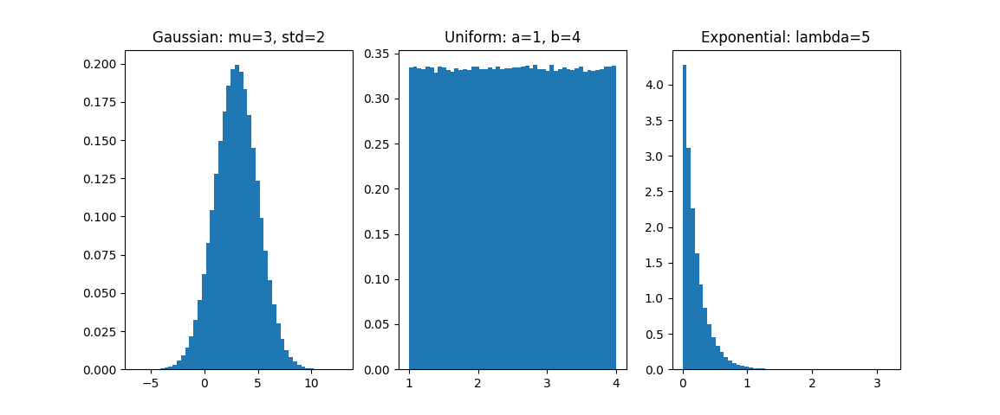
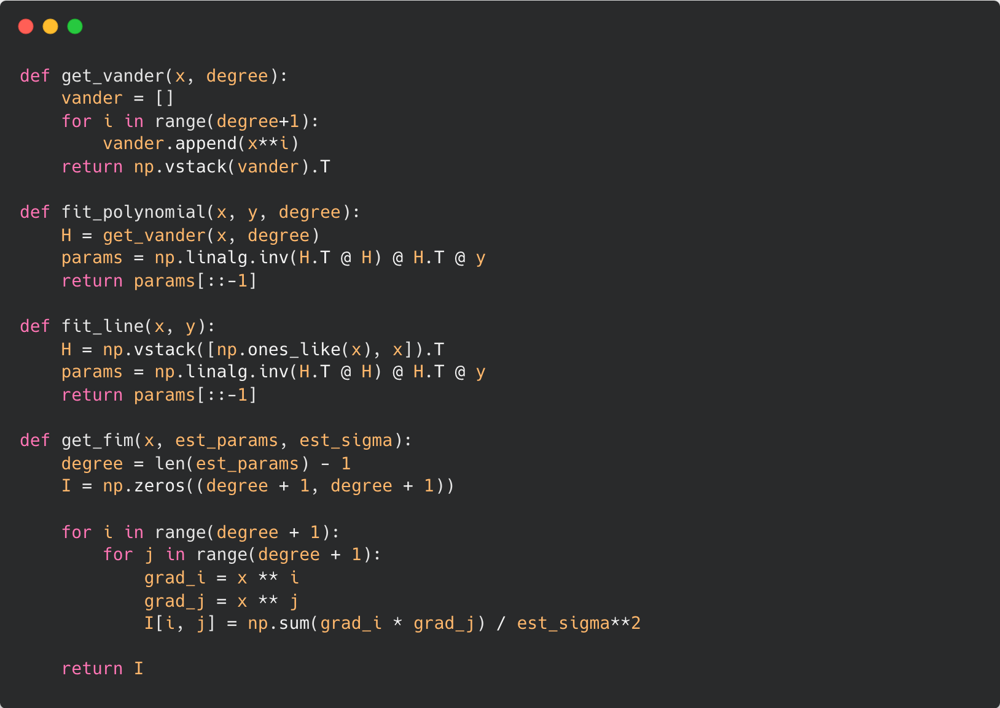

# Assignment - 1 | Estimation Theory
## Problem Statement

-   Line Fitting

-   Polynomial Fitting

-   Comparing Mean and Max Estimators in DC Estimation

## Code

### Helper Functions

**Random Variables:**

<figure>

</figure>

Distributions were generated using Monte Carlo Inversion / Box Muller
Transform from a uniform random variable.

<figure>

</figure>

**Polynomials:** Generates polynomial from a list of params
(coefficients) and also generates noisy (gaussian) polynomials.

<figure>

</figure>

Plots of few polynomials with noise.

<figure>

  

</figure>

**Curve Fitting:**

<figure>

</figure>

Contains code for getting the Vandermonde Matrix (get_vander) and
fitting polynomial:

$$H = \begin{vmatrix}
      1       & x\_{0} & x\_{0}^{2} & \dots & x\_{0}^{n} \\ 
      1       & x\_{1} & x\_{1}^{2} & \dots & x\_{1}^{n} \\
      \vdots  & \vdots&  \vdots   &       & \vdots    \\
      1       & x\_{n} & x\_{n}^{2} & \dots & x\_{n}^{n} \\ 
    \end{vmatrix}$$
*θ* = (*H**T**H*)−1*H**T**y* = *H*†*y*

### Main Code

**Line Fitting**

<figure>

</figure>

**Polynomial Fitting**

<figure>

</figure>

**Comparing Mean and Max Estimators**

<figure>

</figure>

## Results

**Line Fitting**

<figure>

  

</figure>

**Polynomial Fitting**

<figure>

 

</figure>

**Mean vs Max Estimators** Parameter Dependent Uniform -

<figure>

 

<figcaption>(a) DC=1, (b) DC=1000</figcaption>
</figure>

Gaussian -

<figure>

 

<figcaption>(a) DC=1, (b) DC=1000</figcaption>
</figure>

## Discussion

-   I generated different types of random variables and was able to
    verify Law of Large Numbers when I varied number of samples as it
    more closely approximated the real distribution.

-   Using the random variable I had made before I modeled the input data
    (with gaussian noise)

-   Then for the first two parts, the equations for polynomial
    regression were used to get estimations for the polynomial
    coefficients

    $$H = \begin{vmatrix}
                  1       & x\_{0} & x\_{0}^{2} & \dots & x\_{0}^{n} \\ 
                  1       & x\_{1} & x\_{1}^{2} & \dots & x\_{1}^{n} \\
                  \vdots  & \vdots&  \vdots   &       & \vdots    \\
                  1       & x\_{n} & x\_{n}^{2} & \dots & x\_{n}^{n} \\ 
                \end{vmatrix}$$
    *θ* = (*H**T**H*)−1*H**T**y* = *H*†*y*

-   The polynomial corresponding to the theta value was then plotted and
    the Fisher Information Matrix and Cramer Rao Lower Bound was
    calculated.
    *C**R**L**B* = *I*−1(*θ*)

-   For comparing the mean and max estimators, first a "dependent"
    uniform random variable was created:
    *U*(−*α* \* *D**C*, *α* \* *D**C*), *α* = 0.01

-   It was interesting to see that for the dependent uniform, the mean
    estimator followed a bell-like curve and the max estimator was
    similar to a flipped exponential.

-   When the DC value was high, the max estimator was more precise in
    the case of the gaussian.